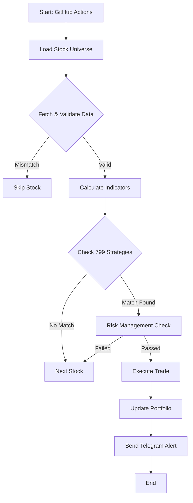

# TradeSage AI: End-to-End Trading Logic 🧠

This document explains exactly how TradeSage AI finds, analyzes, and executes trades. The entire process is automated and runs in about 5 minutes.

---

## 1. The Trigger (Workflow Start) ⏰
**When:** 9:25 AM & 2:55 PM IST (Monday-Friday)
- **Who:** GitHub Actions (Cloud Server)
- **Action:** Wakes up, installs dependencies, and runs the bot script.
- **Goal:** Catch moves at market open and close.

---

## 2. Market Scanning (The Funnel) 🔍

The bot doesn't look at random stocks. It follows a strict funnel:

### Step A: Selection
### Step A: Selection
- **Universe:** It loads a predefined list of **1200 Active Stocks** (Nifty 500 + Microcap 250 + Smallcap 250 + Active Equity).
- **Why?** To cover ~99% of market capitalization/activity. We scan *everything* that trades.

### Step B: Data Fetching (Dual-Source)
For each stock (e.g., `RELIANCE`), the bot fetches live data:
1. **Primary:** TradingView (`tvDatafeed`) - Real-time price.
2. **Secondary:** Yahoo Finance (`yfinance`) - Backup & validation.
3. **Validation:** It compares both prices.
   - If difference > 0.5%, it **skips** the stock (Data Mismatch Alert ⚠️).
   - This prevents trading on bad data glitches.

---

## 3. Analysis & Indicators 📊

Once data is validated, the `IndicatorLibrary` calculates technicals:
- **Trend:** EMA (20, 50, 200), MACD, ADX
- **Momentum:** RSI (14), Stochastic
- **Volatility:** Bollinger Bands, ATR
- **Volume:** VWAP, Volume MA

*The bot now has a detailed "Health Report" for the stock.*

---

## 4. Strategy Matching (The Brain) 🧠

This is the core AI engine. It loads **799 Strategies** extracted from trading books.
For every stock, it checks ALL 799 strategies.

**Example Strategy Check:**
> **Strategy #42 (MACD Crossover):**
> - **Rule 1:** RSI < 70 (Not overbought)
> - **Rule 2:** MACD Line crosses *above* Signal Line
> - **Rule 3:** Price > 200 EMA (Uptrend)

- If **ALL** rules match → **SIGNAL GENERATED ✅**
- If **ANY** rule fails → **SKIP ❌**

The bot ranks signals by **Strategy Confidence Score** (based on historical success rates from the books).

---

## 5. Risk Management Checks 🛡️

Before placing a trade, the `RiskManager` steps in:
1. **Capital Check:** Do we have enough cash? (Max 10% of portfolio per trade).
2. **Position Sizing:**
   - It calculates **Stop Loss (SL)** based on ATR or Strategy rules.
   - It calculates **Target** (usually 1.5x to 2x risk).
   - **Quantity** = (Risk Amount) / (Entry - SL).
   - *Example:* Risking ₹1,000 on a trade with ₹10 SL → Buy 100 shares.
3. **Exposure Check:** Are we already holding this stock? If yes, don't buy more (prevents over-concentration).

---

## 6. Execution (Paper vs. Live) ⚡

### If Paper Trading (Current Mode):
1. **Record:** It adds the trade to `paper_portfolio.json`.
2. **Deduct:** It subtracts the cost from your virtual cash (₹50,000).
3. **Track:** It logs the Entry Price, SL, and Target.

### If Live Trading (Future):
1. **API Call:** It sends a `BUY` order to Angel One API.
2. **Order Type:** Smart Order (Robo Order) with attached Stop Loss and Target.

---

## 7. Exit Management (The Profit Taker) 💰

Every time the bot runs, it **first** checks your *existing* positions:
1. **Get Current Price** of held stocks.
2. **Check Target:** Is Price >= Target?
   - **YES:** SELL immediately. Log Profit. 🎯
3. **Check Stop Loss:** Is Price <= SL?
   - **YES:** SELL immediately. Log Loss. 🛑
4. **Auto-Update:** It updates the portfolio file and calculates your new Balance and ROI.

---

## 8. Reporting (Telegram) 📱

Finally, it sends you a consolidated message:
1. **Exits:** "Sold RELIANCE at ₹2,500 (+₹500)"
2. **New Entries:** "Buying TCS at ₹3,400 (Strategy: MACD Breakout)"
3. **Portfolio:** "Current Balance: ₹51,200 (+2.4%)"

**End of Cycle.** The bot goes back to sleep until the next schedule. 💤

---

## Summary Flowchart

